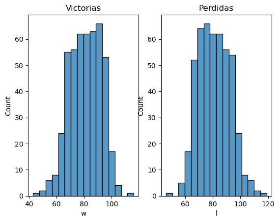

# Proyecto de Análisis Estadístico de Béisbol

## Descripción del Proyecto

Este proyecto tiene como objetivo realizar un análisis estadístico exhaustivo en el ámbito del béisbol, utilizando datos recopilados durante varias temporadas de la MLB. Se han aplicado técnicas de inferencia estadística y se han generado visualizaciones gráficas para identificar patrones, relaciones y tendencias en los datos del béisbol.

## Contexto

El béisbol es un deporte apasionante y lleno de estadísticas fascinantes. Este proyecto se centra en aprovechar esos datos para obtener información valiosa que pueda ayudar a equipos, entrenadores y aficionados a comprender mejor el rendimiento de los jugadores, identificar áreas de mejora y tomar decisiones informadas.

## Metodología

### Recopilación de Datos

Se recopilaron datos detallados de varias temporadas, incluyendo estadísticas de jugadores, resultados de juegos, y diversas métricas relevantes para el análisis.

### Análisis Estadístico

Se aplicaron técnicas de inferencia estadística para extraer conclusiones significativas sobre el rendimiento de los jugadores y el equipo en general. Esto incluyó análisis de tendencias, pruebas de hipótesis y correlaciones.

### Visualización de Datos

Se utilizó la generación de gráficos para representar visualmente las relaciones y patrones identificados durante el análisis estadístico. Esto incluye gráficos de dispersión, gráficos de barras y diagramas de caja para facilitar la interpretación de los resultados.

## Resultados Destacados

### 1. Relación homeruns y victorias

Identificamos patrones de rendimiento excepcionales en los jugadores que realizaban homeruns con las victorias de su equipo.

  

### 2. Análisis de las Victorias y Rangos

Observamos tendencias a lo largo de las temporadas, relacionadas con las victorias que obtenian los equipos y su rango al final de la temporada.

  

### 3. Relación de victorias y perdidas de los equipos

Analizamos la relación entre el desempeño de los equipos y sus resultados en términos de victorias y derrotas. Se generaron gráficos que visualizan esta relación, proporcionando información valiosa sobre la consistencia y éxito general de cada equipo a lo largo de la temporada.

  

### 4. Datos de Regresión

Aplicamos análisis de regresión para modelar y entender la relación entre diversas variables. Los coeficientes, p-valores y gráficos de regresión están disponibles en el directorio "results/regression" para aquellos interesados en explorar más a fondo la dinámica de ciertos aspectos del juego y su impacto en el rendimiento.

  

## Cómo Usar Este Repositorio

1. Clona este repositorio a tu máquina local.
2. Explora los archivos que estan en el repositorio.
3. Observa o realiza nuevos análisis.

## Contribuciones

Siéntete libre de contribuir a este proyecto. Puedes agregar nuevas estadísticas, mejorar el código o proponer nuevas visualizaciones para enriquecer el análisis.

## Contacto

Para preguntas, sugerencias o colaboraciones, no dudes en ponerte en contacto con nosotros.

¡Gracias por explorar nuestro proyecto de análisis estadístico de béisbol! ⚾️
